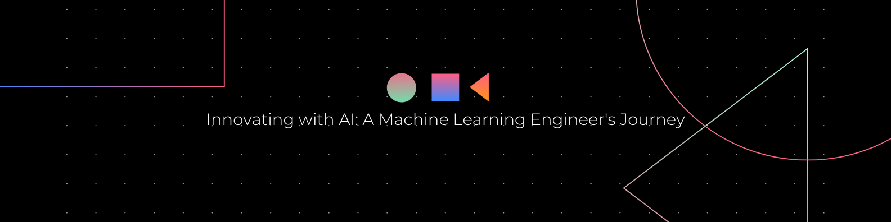

# Hi there! 👋 I'm Umair Tufail

I'm a skilled Machine Learning Engineer with expertise in Python, TensorFlow, PyTorch, Computer Vision, and NLP. Welcome to my GitHub profile!

## 🚀 About Me

I have a deep understanding of Machine Learning algorithms and the ability to develop innovative solutions using my knowledge. As a Machine Learning Engineer, I enjoy creating intelligent systems that can understand and learn from complex data. My goal is to develop models that provide valuable insights and drive business decisions. I'm always staying up-to-date with the latest trends in the field and seeking new challenges and opportunities to apply my skills.

My passion for Machine Learning and commitment to excellence is evident in the work I produce. I pride myself on staying organized, meeting deadlines, and delivering exceptional results. Overall, my expertise, dedication, and creativity make me a highly skilled and successful Machine Learning Engineer.

## 🔧 Skills

PYTHON / PYTORCH / TENSORFLOW / COMPUTER VISION / NLP / HUGGINGFACE / MLOPS

## 🌱 Currently Learning

I'm currently focused on expanding my knowledge in MLOps.

## 📫 Get in Touch

- GitHub: [umairtufail](https://github.com/umairtufail)
- LinkedIn: [umairtufail](https://www.linkedin.com/in/umairtufail/)

## 🏆 Achievements

- GitHub Archive Program Contributor
- GitHub Developer Program Member
- GitHub Pro User
- GitHub Star
- GitHub Sponsor

## 🏆 GitHub Profile Trophies

## 📊 GitHub Stats

## 📊 GitHub Metrics

## 🔥 GitHub Streak Stats

